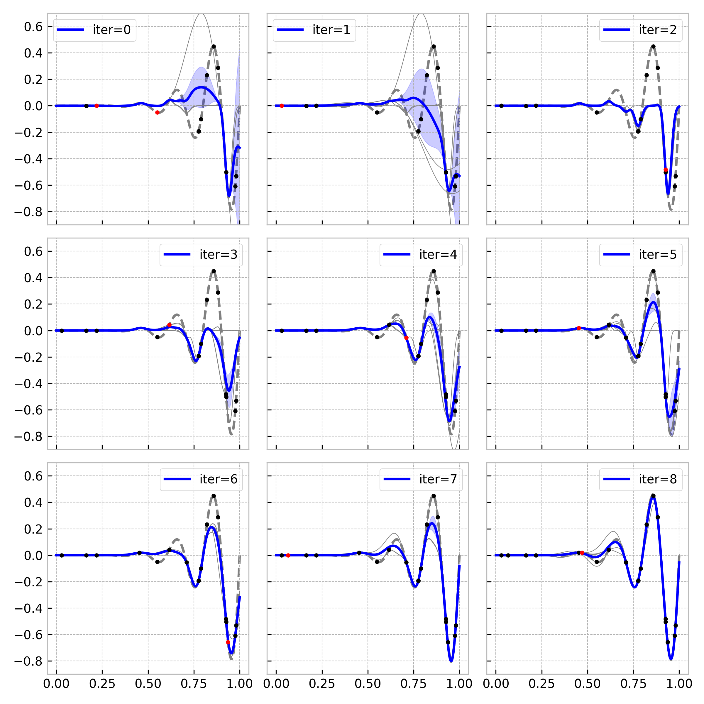
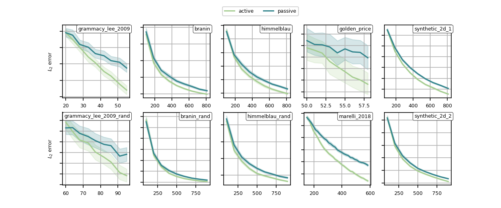

# Active  Strategy for surface response estimation


+ [](https://github.com/eurobios-mews-labs.github.io/active-bagging-learning/actions)
## Installation

```shell
python -m pip install git+https://gitlab.eurobios.com/vlaurent/surrogate-models.git
```

## Literature 
* **Review** [Simpson2001](https://ntrs.nasa.gov/api/citations/19990087092/downloads/19990087092.pdf)


* **Reliability** in [[Marelli2018]](https://arxiv.org/pdf/1709.01589) using polynomial chaos expansion. The problem is to find a region defined by a function $\{x ; \, g(x) \leqslant 0\}$ where $g$ is called limit state function. *Bootstrap approach to estimate variance* 
* **Properties in multilayer percpetron network** [[Fukumizu2000]](https://citeseerx.ist.psu.edu/viewdoc/download?doi=10.1.1.51.1885&rep=rep1&type=pdf) regression problem. Active learning : resampling trapped in local minima ? Redundancy of hidden units in active learning
* Gaussian process using mutual information 
* **Surface response methodology** [[Bezerra2008]](https://d1wqtxts1xzle7.cloudfront.net/45518928/Response_Surface_Methodology_RSM_as_a_20160510-11788-z5s7f4-with-cover-page-v2.pdf?Expires=1647600354&Signature=FWuGdH4xQIPYbo6gjfofYOvSiNCZknuwktVpgOuRU0wbBAjHhrN2a2cYCoLaqFmhLzuJNl~TeX2iXFh7rYFlAfgBwqQh6-lV29XxuU6AJTqj6lkP2MaIMHke4RMcJ6mJN39lXcfg6Ohf5D9TnD7v-Eze4fHCHbklEk9REPok6O0V3MIvx7A4XriV5Tffe5yu1HZ1fCuHBULS5PiRyuRBzKavclvPFQBPDWx5-J~y9a85oB6JGcey3VId7fvtfRUGXXn49WqHm3fJfqpLbYj62drFGjE6XcmBWm1CzBn0Guaf~ig8k6JfI9wOrErxofAkR8tjnd51VUAelB0XCY4v1A__&Key-Pair-Id=APKAJLOHF5GGSLRBV4ZA) based on linear models
## Context 

Plug in approach to active learning for surface response estimation

* The objective is to approximate function $`f \in \mathcal{X} \rightarrow \mathbb{R}^n`$.
* **Objective :** find an estimation of $`f`$, $`\hat{f}`$ in a family of measurable function $`\mathcal{F}`$ such that $` f^* = \underset{\hat{f} \in \mathcal{F}}{\text{argmin}} \|f - \hat{f} \| `$ 
* At time $`t`$ we dispose of a set of $`n`$ evaluations $`(x_i, f(x_i))_{i\leqslant n}`$
* All feasible points can be sampled in domain $`\mathcal{X}`$

## Basic usage

```python

import numpy as np
import pandas as pd
from sklearn.ensemble import ExtraTreesRegressor

from active_learning import ActiveSurfaceLearner
from active_learning.components.active_criterion import ServiceVarianceEnsembleMethod
from active_learning.components.query_strategies import ServiceQueryVariancePDF
from active_learning.benchmark import functions

fun = functions.grammacy_lee_2009  # The function we want to learn
bounds = np.array(functions.bounds[fun])  # [x1 bounds, x2 bounds]
n = 50
X_train = pd.DataFrame(
    {'x1': (bounds[0, 0] - bounds[0, 1]) * np.random.rand(n) + bounds[0, 1],
     'x2': (bounds[1, 0] - bounds[1, 1]) * np.random.rand(n) + bounds[1, 1],
     })  # Initiate distribution
y_train = -fun(X_train)

active_criterion = ServiceVarianceEnsembleMethod(  # Parameters to be used to estimate the surface response
    estimator=ExtraTreesRegressor(  # Base estimator for the surface
        max_features=0.8, bootstrap=True)
)
query_strategy = ServiceQueryVariancePDF(bounds, num_eval=int(20000))

# QUERY NEW POINTS
active_learner = ActiveSurfaceLearner(
    active_criterion,               # Active criterion yields a surface
    query_strategy,                 # Given active criterion surface, execute query 
    bounds=bounds)

active_learner.fit(    
    X_train,                        # Input data X
    y_train)                        # Input data y (target))
    
X_new = active_learner.query(3)     # Request 3 points
```
To use the approach, one has to dispose of

1. An estimator (a set of function) to fit the surface (linear model, gaussian vectors, etc.) in sklearn's API (`base_estimator` parameter)
2. A surface describing an active learning criterion that will adjust the estimator and estimate its variance in some way (`active_criterion` component).
3. A resampling strategy that will take a function (the active criterion surface) and makes it a query (`query_strategy` component).


## Exemples

* 1D example :  



## Benchmark





