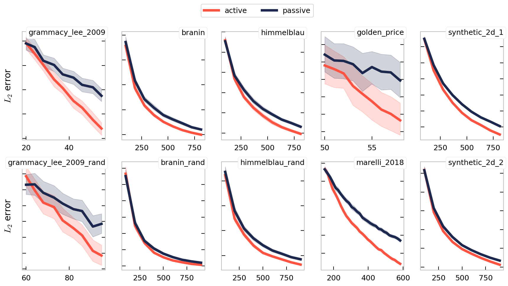

[]( https://github.com/eurobios-mews-labs/active-bagging-learning/blob/master/LICENSE)

[](https://GitHub.com/eurobios-mews-labs/active-bagging-learning/graphs/commit-activity)
# Active  Strategy for surface response estimation
This library proposes a plug-in approach to active learning utilizing bagging techniques.
Bagging, or bootstrap aggregating, is an ensemble learning method designed to improve
the stability and accuracy of machine learning algorithms. By leveraging bagging, 
we aim to enhance the efficiency of active learning strategies in approximating the target function $`f`$.
* The objective is to approximate function $`f \in \mathcal{X} \rightarrow \mathbb{R}^n`$.
* **Objective :** find an estimation of $`f`$, $`\hat{f}`$ in a family of measurable function $`\mathcal{F}`$ such that $` f^* = \underset{\hat{f} \in \mathcal{F}}{\text{argmin}} \|f - \hat{f} \| `$ 
* At time $`t`$ we dispose of a set of $`n`$ evaluations $`(x_i, f(x_i))_{i\leqslant n}`$
* All feasible points can be sampled in domain $`\mathcal{X}`$
* This tools enable users to query new point based on uncertainty measure.


## Installation

```shell
python -m pip install git+https://github.com/eurobios-mews-labs/active-bagging-learning.git
```


## Basic usage

```python

import numpy as np
import pandas as pd
from sklearn.ensemble import ExtraTreesRegressor

from active_learning import ActiveSurfaceLearner
from active_learning.components.active_criterion import VarianceEnsembleMethod
from active_learning.components.query_strategies import ServiceQueryVariancePDF
from active_learning.benchmark import functions

fun = functions.grammacy_lee_2009  # The function we want to learn
bounds = np.array(functions.bounds[fun])  # [x1 bounds, x2 bounds]
n = 50
X_train = pd.DataFrame(
    {'x1': (bounds[0, 0] - bounds[0, 1]) * np.random.rand(n) + bounds[0, 1],
     'x2': (bounds[1, 0] - bounds[1, 1]) * np.random.rand(n) + bounds[1, 1],
     })  # Initiate distribution
y_train = -fun(X_train)

active_criterion = VarianceEnsembleMethod(  # Parameters to be used to estimate the surface response
    estimator=ExtraTreesRegressor(  # Base estimator for the surface
        max_features=0.8, bootstrap=True)
)
query_strategy = ServiceQueryVariancePDF(bounds, num_eval=int(20000))

# QUERY NEW POINTS
active_learner = ActiveSurfaceLearner(
    active_criterion,  # Active criterion yields a surface
    query_strategy,  # Given active criterion surface, execute query 
    bounds=bounds)

active_learner.fit(
    X_train,  # Input data X
    y_train)  # Input data y (target))

X_new = active_learner.query(3)  # Request 3 points
```
To use the approach, one has to dispose of

1. An estimator (a set of function) to fit the surface (linear model, gaussian vectors, etc.) in sklearn's API (`base_estimator` parameter)
2. A surface describing an active learning criterion that will adjust the estimator and estimate its variance in some way (`active_criterion` component).
3. A resampling strategy that will take a function (the active criterion surface) and makes it a query (`query_strategy` component).


## Exemples

* 1D example :  


## Benchmark





